## 💌 Simple sns

>Spring-Boot와 JPA를 활용해 구현한 간단한 SNS 프로젝트입니다.
>사용자는 회원가입, 로그인, 게시글 작성, 댓글 작성, 좋아요 기능 등을 통해 기본적인 SNS 기능을 경험할 수 있습니다.

 

## 주요 기능

* 회원가입 및 로그인 (Spring Security, JWT 토큰 기반 인증)
* 게시글 CRUD(Create, Read, Update, Delete)
* 댓글 CRUD
* 게시글 좋아요 기능
* 사용자 권한(Role) 관리
* 예외 처리 및 유효성 검사

 

## 기술 스택

* Java 17
* Spring Boot 3.x
* Spring Security (JWT)
* JPA (Hibernate)
* MySQL
* Gradle
* Swagger (API 문서화)

 

## Application Architecture 

## Flow Chart

1. 회원가입

2. 로그인

3. 포스트 작성

4. 포스트 삭제

5. 포스트 수정

6. 피드 목록

7. 좋아요 기능 : User A가 B 게시물에 좋아요를 누른 상황

8. 댓글 기능 : User A가 B 게시물에 댓글을 남긴 상황

```mermaid
  sequenceDiagram
    autonumber
    client ->> server: 댓글 작성
    alt 성공한 경우 
    server ->> db : 좋아요 누를 수 있는 조건 체크 
    db -->> server : 응답 
    server --) kafka : event produce request
    server->>client: 성공 반환
    kafka --) server : event consume 
    server ->> db : db update 요청
    db -->> server : 성공 반환 
    
    else 로그인하지 않은 경우
    server->>client: reason code와 함께 실패 반환
    
    else db 에러
    server ->> db : 댓글 작성 조건 체크 
    db -->> server : 응답 
    server --) kafka : event produce request
    server->>client: 성공 반환
    kafka --) server : event consume 
    loop db update 실패시 최대 3회 재시도 한다
        server ->> db : db update 요청
    end
    db -->> server : 실패 반환 
    
    else B 게시물이 존재하지 않는 경우 
    server ->> db : 댓글 작성 조건 체크 
    db ->> server : 에러 반환
    server->>client: reason code와 함께 실패 반환
    
    else 내부 에러
    server->>client: reason code와 함께 실패 반환
    end
```

9. 알람 기능 : User A의 알람 목록에 대한 요청을 한 상황

 

#### 🙋‍♀️ 만든 사람

- 👩‍💻 이름: 양수영 (Yang Sooyoung)
- 🔗 GitHub: [@Yang-Sooyoung](https://github.com/Yang-Sooyoung)

 

